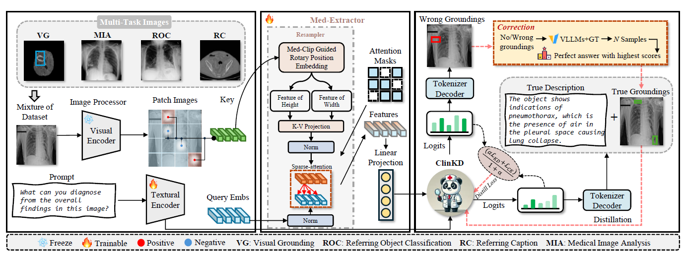
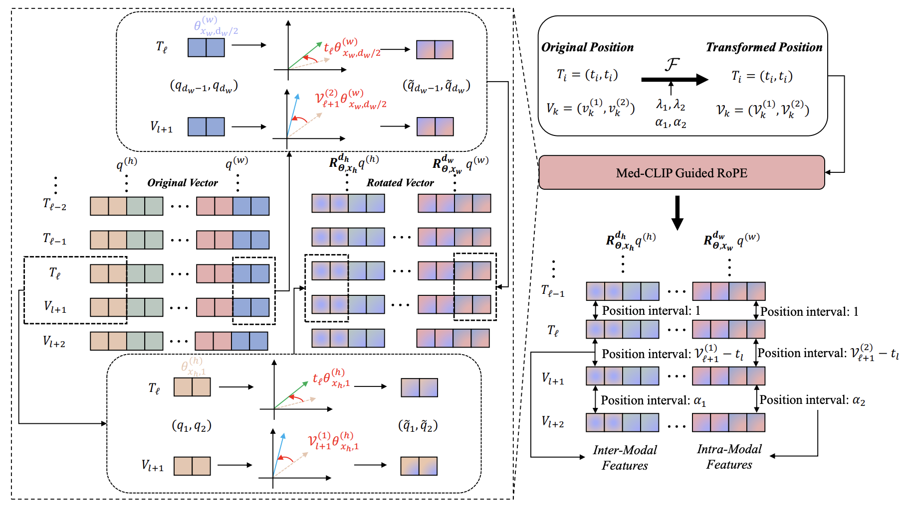
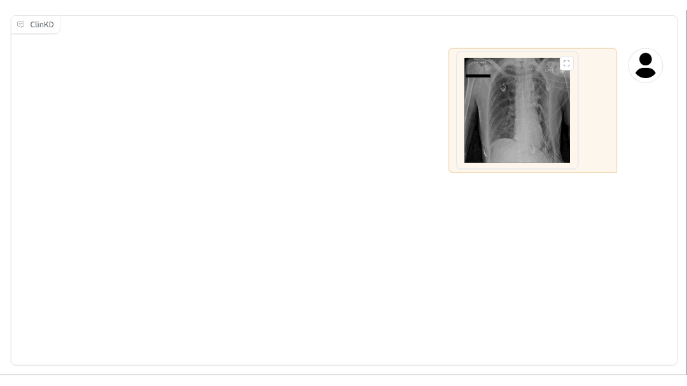

<div id="top" align="center">
<p align="center">
    <!--  -->
    <!--  -->
</p>
</div>

<div align="center">
<!--  -->
  <h2>ClinKD: Cross-Modal Clinical Knowledge Distiller<br> For Multi-Task Medical Images</h2>
  <!-- <p>🧠 Med-VQA | 🤖 MLLMs | 📊 Pseudo-Lables Knowledge Distillation  </p> -->
   <!--  -->
  <!-- <div style="overflow: hidden;">
    <h2 style="margin-top: 0;">ClinKD:
    Cross-Modal Clinical Knowledge Distiller For Multi-Task Medical Images</h2> -->
  </div>
  <div align="center">
     <p>
    
    
    
    

  </p>
</div>

## ✨ Framework


We propose a medical knowledge distillation framwork which bridges medical knowledge gap in Qwen2-VL. As shown in the figure, the image features will be captured by **Med-CLIP Guided RoPE** on different dimension, and then comes the distillation and stf part.
## 💡 Highlights 

- 🔥 **Med-CLIP Guided RoPE:** We propose the Med-CLIP Guided RoPE to improve image-text alignment by fixing distinct intervals between different modal features. The modified model is in `model/modeling_qwen2_vl.py`



As shown in the example, we think the traditional index interval will miss the cross-modal information which may influence the performance of alignment, hence we set different index intervals so that the rotation angles will be distinct, making cross-modal features more easy to be captured. 
- 🔥 **Clinical Knowledge Distiller:** The Clinical Knowlegde Distiller comprise Pseudo-Labels Medical Distillation and Reflective Correction Training. We use pseudo-labels to overcome the limitation caused by medical knowledge gap.

- 🔥 **Semantic-Aware Selective Generation:** The SASG part is used for the best answer with semantic similarity.

## 📕 Dataset
- For the images downloading, please refer to the [SAM-Med2D](https://github.com/OpenGVLab/SAM-Med2D).
- For QA pairs, please search the git repo of [BiRD](https://github.com/ShawnHuang497/BiRD?tab=readme-ov-file) (We are not allowed to redistribute the original dataset a second time, but you can easily obtain it from the original author).
## 

## 🚀 Usage
We recommend [LLaMA-Factory](https://github.com/hiyouga/LLaMA-Factory) for training Qwen2-VL. You may need to convert the original dataset format to the ShareGPT format. We provide the python code for converting format in `data/transfer2sharegpt.py`
### 🛠️ Train
1. Install LLaMA-Factory.
```shell
git clone --depth 1 https://github.com/hiyouga/LLaMA-Factory.git
cd LLaMA-Factory
pip install -e ".[torch,metrics]"
```
2. Launch LLaMA Board GUI.
```shell
llamafactory-cli webui
```
3. Setup training configuration. (We provide our config file in `config/train_config.yaml`)

For other usage, please refer to [LLaMA-Factory](https://github.com/hiyouga/LLaMA-Factory).
If you want to do knowledge distillation, you need to write Trainer as:
```python
class PseudoKDTrainer(Trainer):
    
    def __init__(
        self,
        model = None,
        teacher_model = None,
        if_use_entropy = False,
        args = None,
        data_collator = None, 
        train_dataset = None,
        eval_dataset = None,
        tokenizer = None,
        model_init = None, 
        compute_metrics = None, 
        callbacks = None,
        optimizers = (None, None), 
        preprocess_logits_for_metrics = None,
    ):
        super().__init__(
            model,
            args,
            data_collator,
            train_dataset,
            eval_dataset,
            tokenizer,
            model_init,
            compute_metrics,
            callbacks,
            optimizers,
            preprocess_logits_for_metrics,
        )
        self.teacher_model = teacher_model
        self.if_use_entropy = if_use_entropy
        
    
    def compute_loss(self, model, inputs, return_outputs=False):
        
        outputs = model(**inputs)
        with torch.no_grad():
            teacher_outputs = self.teacher_model(**inputs)
        
        loss = outputs.loss
        logits = outputs.logits
        teacher_logits = teacher_outputs.logits
        
        if logits.shape[-1] != teacher_logits.shape[-1]:

            teacher_logits = teacher_logits[:, :, :logits.shape[-1]]
        
        labels = inputs['labels']
        kl = compute_fkl(logits, teacher_logits, labels, padding_id=-100, temp=0.5)
        
        if self.if_use_entropy:
            loss_total = (0.5 * kl + loss) / 1.5
        else:
            loss_total = kl
        
        return (loss_total, outputs) if return_outputs else loss_total
```
Knowledge distillation cost huge GPU memories, please use `export PYTORCH_CUDA_ALLOC_CONF=expandable_segments:True` to save GPU memories.


### 📜 Evaluation
### Step 1: Inference

```shell
sh test_metric/infer_all.sh
```

### Step 2: Evaluate
```shell
sh test_metric/eval_all.sh
```
## 📂 Checkpoints
We will release our checkpoint in July, 2025

## 🕹️ Demo

